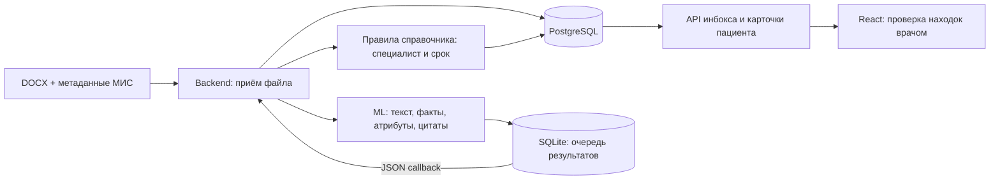

# MEDITRON — frontend + backend + ML

Проект собран из `meditron-smclinic-feature-dict-v2.zip` и текущего ML
`dict-v2.1-extractor-6`. Все исходники для запуска находятся здесь.
Оригинальный проект, архив и исходные протоколы не изменены.



ML получает справочник от бэкенда. Файл обрабатывается локально, без облачной модели,
изображений и OCR. Метаданные пациента передаёт МИС; демонстрационный скрипт создаёт
вымышленные данные. JSON callback содержит факты, а бэкенд применяет правила маршрутизации.

## Быстрый запуск на этом компьютере

Подготовлены Java JAR, Python-окружение и отдельная PostgreSQL в `.local/`.
Из PowerShell:

```powershell
cd C:\hackaton\final
.\scripts\Start-Local.ps1
```

- Backend / Swagger: http://127.0.0.1:18080/swagger-ui/index.html
- ML / Swagger: http://127.0.0.1:18000/docs
- Проверка backend: http://127.0.0.1:18080/actuator/health
- Проверка ML: http://127.0.0.1:18000/health
- PostgreSQL: `127.0.0.1:15432`, база `meditron_final_test`.

Подготовленная база содержит результаты тестов, включая 89 локальных протоколов.
Она находится в игнорируемой `.local/`; передавать эту папку вместе с исходниками не нужно.
По умолчанию локальные сервисы слушают только localhost.

Остановка:

```powershell
.\scripts\Stop-Local.ps1
```

## Отправить свой DOCX через бэкенд

```powershell
cd C:\hackaton\final
.\ml\.venv\Scripts\python.exe scripts/submit_protocol.py --file "C:\hackaton\src\протоколы\протоколы молочная железа\молочн железа (4).docx" --study-type BREAST
```

Скрипт создаёт нового вымышленного пациента и идентификаторы, отправляет файл именно
в backend, ждёт callback и печатает JSON из backend. `studyDate` в этом демо — текущая
дата, возраст условный. Для реальных метаданных и исправлений используйте `--metadata`:

```powershell
.\ml\.venv\Scripts\python.exe scripts/submit_protocol.py --file "C:\путь\протокол.docx" --metadata "C:\путь\metadata.json"
```

Формат JSON, версии и аннулирование: [инструкция интеграции](docs/integration.md).

## Запуск на другой машине

Вариант с Docker (frontend + PostgreSQL + backend + ML):

```powershell
if (!(Test-Path .env)) { Copy-Item .env.example .env }
docker compose up --build -d --wait --wait-timeout 180
docker compose ps
```

Интерфейс: http://127.0.0.1:3000 . Порты Docker по умолчанию: frontend `3000`,
backend `8080`, ML `8000`, PostgreSQL `5432`.
При использовании скриптов передайте `--backend http://127.0.0.1:8080`.
Данные PostgreSQL и очередь ML сохраняются в разных именованных томах.
Все четыре Docker-контейнера собраны и запущены с состоянием
`healthy`. Прошли 169 ML-тестов, 45 JUnit-тестов, 17 сквозных сценариев,
21 frontend unit test и 43 браузерные проверки. Проверены все 19 API backend и 4 API ML.
Ранее отдельно проверена обработка 89/89 исходных DOCX; их рабочие записи сохранены.
Подробные команды, сохранение данных и повторные проверки: [Docker](docs/docker.md).
Обзор добавленного интерфейса и его проверки: [frontend](docs/frontend-review.md).

На этом Windows-компьютере у Docker Desktop воспроизводится ошибка временных
сокетов после перезапуска. Для запуска с её устранением подготовлен скрипт:

```powershell
.\scripts\Start-Docker.ps1 -RepairDesktop
```

Он останавливает Desktop, сохраняет только две проверенные папки временных сокетов,
создаёт новые и запускает проект. Базы, образы и настройки сохраняются.
При работающем Docker достаточно `.\scripts\Start-Docker.ps1`.

Вариант без Docker: Java 21+, Maven, Python 3.12 и PostgreSQL 16.

```powershell
# Остановить работающий backend перед пересборкой JAR на Windows.
cd backend
mvn package
cd ..
py -3.12 -m venv ml/.venv
.\ml\.venv\Scripts\python.exe -m pip install -r ml/requirements-lock.txt
# Создать отдельную БД в своей PostgreSQL, затем:
.\scripts\Start-Local.ps1 -SkipPostgres -PostgresPort 5432 -Database meditron -DbUser meditron -DbPassword "ваш пароль"
```

Для этого компьютера portable PostgreSQL скачана из
[официального каталога EDB](https://www.enterprisedb.com/download-postgresql-binaries)
и инициализирована отдельно; системная служба не устанавливалась.

## Проверки

Используйте отдельный стенд: интеграционные тесты создают пациентов.
Его собственные тома не меняют рабочую базу и список на порту 3000.

```powershell
cd C:\hackaton\final
docker compose -p meditron-verification -f docker-compose.yml -f compose.verification.yaml up --build -d --wait
Push-Location ml
.\.venv\Scripts\python.exe -m unittest discover -s tests -v
Pop-Location
Push-Location backend
mvn test
Pop-Location
.\ml\.venv\Scripts\python.exe -X utf8 tests/integration.py
# Дополнительно прогнать все локальные DOCX через backend → ML → backend:
.\ml\.venv\Scripts\python.exe -X utf8 tests/integration.py --corpus "C:\hackaton\src\протоколы"
```

Проверка отключения и перезапуска сервисов на отдельных портах:

```powershell
$env:DB_URL="jdbc:postgresql://127.0.0.1:15432/meditron_final_test"
$env:DB_USER="meditron"
$env:DB_PASSWORD="meditron-local-test"
.\ml\.venv\Scripts\python.exe tests/resilience.py --java "C:\Program Files\Java\jdk-25\bin\java.exe"
```

[Отчёт проверки](docs/verification.md) перечисляет результаты и покрытие эндпоинтов.
Машинные отчёты и логи находятся в `.local/`.

## Состав и границы реализации

| Папка | Содержимое |
|---|---|
| `backend/` | Приём DOCX, HTTP-клиент ML, callback, PostgreSQL, правила, инбокс, действия врача |
| `ml/` | DOCX-парсер, извлечение фактов по справочнику, проверка контракта, SQLite, HTTP API, 169 тестов |
| `scripts/` | Локальный запуск/остановка и отправка DOCX через backend |
| `tests/` | Сквозные HTTP-проверки, все реализованные API, восстановление после сбоев |
| `docs/` | Контракты, инструкция, отчёт; `imported-backend/` — исходные README архива |
| `frontend/` | React/Vite, nginx, списки и карточка пациента, действия врача, тесты; настройки и картотека — заглушки |

Бэкенд рассчитывает направление, уровень и срок для находок, сохраняет подтверждения
врача. Исполнение маршрутов, шаги, уведомления и таймеры эскалации ещё
не реализованы в полученном проекте; `routes` возвращается пустым. API входа и выхода
подготовлен для единственного тестового аккаунта `123` / `123`; формы входа пока нет,
обязательная авторизация отключена до её подключения. Это локальная связка для хакатона.

[Тестовые пациенты, сортировка и подключение формы входа](docs/demo-and-auth.md):
17 явно помеченных сценариев, команда их создания и контракт сессии.
Интерфейс использует реальный API по умолчанию; автономная презентация на
вымышленных данных включается явно через `?mock=1` и обозначена как демо.

Медицинский YAML сохранён без изменения порогов. В нём, например, BI-RADS ≥ 5 даёт
срок 3 дня, но наследует `level: PLANNED`; интерфейс получит именно эти значения.
Это особенность исходного справочника, которую следует согласовать в следующей версии.
